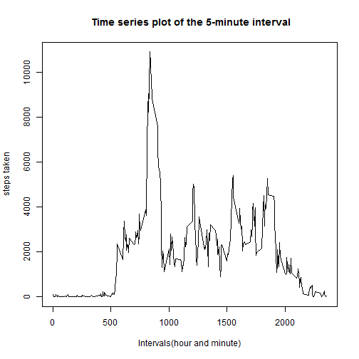
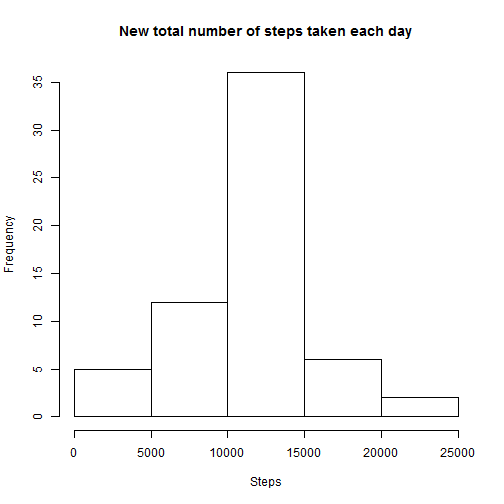
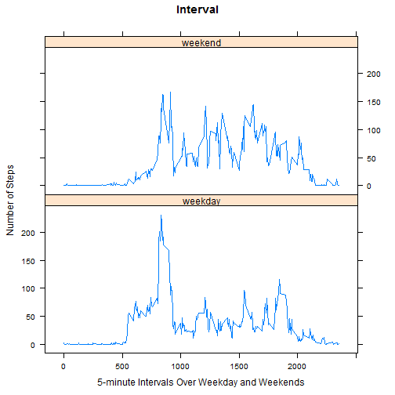

#Reproducible Research Project: Peer Assessment 1
   
  
## 1.Loading and preprocessing the data
First of all, we need to load the data from the file(saved with the variable name "data").   
In addition, a brief summary about the data is also shown.


```r
data <- read.csv("activity.csv",na.string="NA")
summary(data)
```

```
##      steps               date          interval   
##  Min.   :  0.0   2012-10-01:  288   Min.   :   0  
##  1st Qu.:  0.0   2012-10-02:  288   1st Qu.: 589  
##  Median :  0.0   2012-10-03:  288   Median :1178  
##  Mean   : 37.4   2012-10-04:  288   Mean   :1178  
##  3rd Qu.: 12.0   2012-10-05:  288   3rd Qu.:1766  
##  Max.   :806.0   2012-10-06:  288   Max.   :2355  
##  NA's   :2304    (Other)   :15840
```


## 2.What is mean total number of steps taken per day?
After that, we stick to task two. First, we need to split the data according to the date. We can use the aggregate function and the result is saved in data_by_day;

```r
data_by_day <- aggregate(steps~date, data=data, FUN = sum)
```


Then we can make the plot and calculate the mean and median. They are shown as below.

```r
hist(data_by_day$steps, main = "Total number of steps taken each day",xlab = "Steps")
```

 

```r
day_mean = mean(data_by_day$steps)
day_median = median(data_by_day$steps)
```
In conclusion, the mean total number of steps taken per day is 1.0766 &times; 10<sup>4</sup> and median is 10765.
  
  
## 3.What is the average daily activity pattern?
Then we go to task three. As before, we will first split the data accoring to the intervals..

```r
data_by_interval <- aggregate(steps~interval, data=data, FUN = sum)
```
Then we can make the plot and find the maximum, as shown below.

```r
plot(data_by_interval,type="l",xlab="Intervals(hour and minute)",
     ylab = "steps taken", main = " Time series plot of the 5-minute interval")
```

 

```r
max_interval <- data_by_interval[which.max(data_by_interval$steps),"interval"]
```
The result shows that the max interval happens in 835 every day.

## 4.Imputing missing values
Now we deal some task relating to missing values.First, we need to find the total number of missing values.

```r
total <- sum(is.na(data))
```
So there are 2304  subjects that has NA.
Then, I assume that the 5-minute inteval will be a good estimate of the missing values, so we just copy the original data, replace the NAs with the 5-minute interval average. Afterwards, the new summary is shown.

```r
average_by_interval <- aggregate(steps~interval, data=data, FUN = mean)
newdata <- data
for (i in 1:nrow(newdata)) 
{
   tmp <- newdata[i, ]
    if (is.na(tmp$steps)) 
    {
        tmp_i = i %% 288 
        if (tmp_i == 0)
        {
            tmp_i = 288
        }
        newdata[i,]$steps <- average_by_interval[tmp_i,2]
    } 
}
summary(newdata)
```

```
##      steps               date          interval   
##  Min.   :  0.0   2012-10-01:  288   Min.   :   0  
##  1st Qu.:  0.0   2012-10-02:  288   1st Qu.: 589  
##  Median :  0.0   2012-10-03:  288   Median :1178  
##  Mean   : 37.4   2012-10-04:  288   Mean   :1178  
##  3rd Qu.: 27.0   2012-10-05:  288   3rd Qu.:1766  
##  Max.   :806.0   2012-10-06:  288   Max.   :2355  
##                  (Other)   :15840
```
As in task two, we can make a plot and calculate the mean and median.

```r
newdata_by_day <- aggregate(steps~date, data=newdata, FUN = sum)
hist(newdata_by_day$steps, main = "New total number of steps taken each day",xlab = "Steps")
```

 

```r
newday_mean = mean(newdata_by_day$steps)
newday_median = median(newdata_by_day$steps)
```
In conclusion, the new mean is 1.0766 &times; 10<sup>4</sup> and median is 10765.


## 5.Are there differences in activity patterns between weekdays and weekends?
As instructed, we need to create a factor to indicate the "weekday" and "weekend". 

```r
Sys.setlocale("LC_TIME", "English")
```

```
## [1] "English_United States.1252"
```

```r
newdata$date <- as.Date(newdata$date)
tmp_weekend <- c("Saturday", "Sunday")
newdata$daytype <- as.factor(sapply(newdata$date, function(x) ifelse(weekdays(x) %in%  tmp_weekend, "weekend", "weekday")))
summary(newdata)
```

```
##      steps            date               interval       daytype     
##  Min.   :  0.0   Min.   :2012-10-01   Min.   :   0   weekday:12960  
##  1st Qu.:  0.0   1st Qu.:2012-10-16   1st Qu.: 589   weekend: 4608  
##  Median :  0.0   Median :2012-10-31   Median :1178                  
##  Mean   : 37.4   Mean   :2012-10-31   Mean   :1178                  
##  3rd Qu.: 27.0   3rd Qu.:2012-11-15   3rd Qu.:1766                  
##  Max.   :806.0   Max.   :2012-11-30   Max.   :2355
```
Finally, we can make the plot as required.


```r
require(plyr)
```

```
## Loading required package: plyr
```

```r
require(lattice)
```

```
## Loading required package: lattice
```

```r
tmp <- ddply(newdata,.(interval,daytype), summarize, steps = mean(steps))
xyplot(steps ~ interval | daytype, data = tmp, layout = c(1, 2), type = "l", 
    xlab = "5-minute Intervals Over Weekday and Weekends", ylab = "Number of Steps", main = "Interval")
```

 


All in all, we finish analyzing the whole data.
